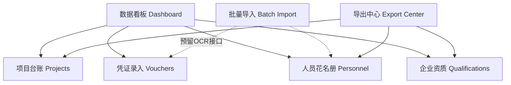

# 🌟 建筑工程维护系统 (Construction Maintenance System)

[](https://www.python.org/)
[](https://flask.palletsprojects.com/)
[](https://www.sqlite.org/)
[](https://docs.pytest.org/)
[](https://github.com)

这是一个专为建筑工程公司量身定制的轻量级、高品质综合信息维护系统。系统基于 **Python Flask + SQLite + Jinja2 + openpyxl** 独立构建，完美结合了商业级美学标准与卓越的技术实现。系统采用精心设计的 **“深邃翠绿主题（Premium Emerald Theme）”**，辅以平滑的过渡动画与极致灵敏的交互设计，带来无与伦比的用户体验。

---

## 🎨 视觉与交互美学 (UI Design Aesthetics)

本系统突破了传统企业级后台系统的枯燥和单调，遵循现代 UI/UX 设计法则：
* **深邃翠绿主色调**：以深邃翠绿（Emerald HSL 色系）为主导，结合精致的暗色侧边栏（Sidebar）与轻盈的淡卡其/灰底色，塑造极高专业感。
* **状态标记 (Badges)**：使用明晰、柔和的 HSL 颜色标识项目与资料状态（如“进行中”、“已完工”、“已暂停”、“待确认”），视觉边界清晰。
* **微光过渡与动效**：按钮悬停（Hover）、导航切换及卡片组件拥有平滑的 CSS 缓动动画，让系统界面充满灵动活力。
* **流式自适应布局**：采用 CSS Grid / Flexbox 混合布局，无缝适配不同尺寸的电脑与平板终端。

---

## 📊 核心业务功能模块 (Core Modules)

系统涵盖了建筑工程日常运营与资料合规管理的核心闭环：



### 1. 📊 智能数据看板 (Dashboard)
* **动态指标卡片**：自动实时统计并呈现 **本月项目支出**、**累计项目支出**、**月度凭证数量**、**待确认资料队列**及**临期资质证书**等核心经营指标。
* **多维深度排行**：直观展示“项目支出排行榜”与“费用科目构成分析”，帮助管理层秒级洞察资金流向。

### 2. 📁 规范项目台账 (Projects Ledger)
* **全生命周期管理**：支持录入工程项目全要素（项目名称、项目负责人、开工日期、状态、备注）。
* **动态状态追踪**：以高对比度、呼吸感十足的 Badge 展现项目的进行、完工或暂停状态。

### 3. ✍️ 精确凭证录入 (Vouchers Record)
* **明细流水记账**：详细记录每一笔项目支出的日期、科目类别、金额、录入人、备注。
* **防错校验机制**：内置金额自动格式化、负数及非数字输入强校验，确保入库财务数据 100% 准确。

### 4. 👥 施工人员花名册 (Personnel Directory)
* **详尽人员档案**：记录一线施工人员的姓名、身份证号、性别、年龄、工种、电话、银行卡号及完整开户行信息。
* **Excel 一键导入**：支持解析规范的 Excel 花名册模板，支持大批量人员信息毫秒级自动解析与导入。

### 5. 🛡️ 企业资质合规性 (Qualifications Control)
* **防漏风控机制**：登记合作单位证书，记录编号、发证机关、到期时间（支持设定“长期有效”）。
* **主动临期预警**：临期证书自动在看板以醒目警示色提示，防范因资质过期导致的合规风险。

### 6. 📥 批量录入队列 (Batch Import)
* **拖拽式极简上传**：提供拖拽上传发票、身份证扫描件等附件文件的交互区域。
* **待确认任务队列**：引入临时任务缓冲队列，完美承接并预留未来的 AI / OCR 解析接入能力。

### 7. 📤 一键导出中心 (Export Center)
* **专业报表输出**：基于 `openpyxl` 引擎，支持一键导出排版精美、格式规范的“项目台账 Excel”、“人员花名册 Excel”和“企业资质 Excel”。

---

## 🛠️ 项目技术架构 (Architecture Overview)

项目严格遵循清晰的**三层架构与依赖注入（Repository / Service Pattern）**设计模式，极大地提高了代码的可维护性与单元测试可读性：

* **Web/Presentation Layer**：基于 Flask Blueprint 路由与 Jinja2 精美模版，配合安全健壮的 `forms.py` 进行表单清洗。
* **Service Layer**：包含 `dashboard.py`（指标聚合业务）、`exports.py`（基于 openpyxl 的高级 Excel 格式化）和 `imports.py`（Excel 导入解析）。
* **Data Access Layer (Repository)**：在 `repositories.py` 中抽象了对 SQLite 数据库的原子化增删改查逻辑，与 Flask 上下文松耦合。
* **Infrastructure**：`db.py` 负责连接管理、Foreign Key 级联约束激活以及数据库的自动初始化与种子数据（Seed Data）填充。

---

## 📂 项目目录结构 (Directory Tree)

```text
CAM/
│
├── construction_maintenance/         # 系统主包目录
│   ├── __init__.py                   # 导出应用工厂函数
│   ├── app.py                        # 核心应用工厂 (App Factory)
│   ├── config.py                     # 全局路径及环境变量配置
│   ├── db.py                         # SQLite 数据库底层管理与表结构初始化
│   ├── repositories.py               # 数据持久化仓储层 (Repository Pattern)
│   │
│   ├── services/                     # 核心业务服务层
│   │   ├── __init__.py
│   │   ├── dashboard.py              # 看板数据统计与聚合计算
│   │   ├── exports.py                # 优雅的 openpyxl Excel 导出实现
│   │   └── imports.py                # 批量文件处理与花名册 Excel 解析导入
│   │
│   ├── static/                       # 静态资源
│   │   └── app.css                   # 精美的 "Premium Emerald Theme" CSS 样式表
│   │
│   ├── templates/                    # Jinja2 模版系统 (以模块划分子页面)
│   │   ├── base.html                 # 全局基础模版（含美观侧边栏）
│   │   ├── dashboard.html            # 看板页
│   │   ├── projects.html             # 项目台账页
│   │   ├── vouchers.html             # 凭证录入页
│   │   ├── personnel.html            # 人员花名册页
│   │   ├── qualifications.html       # 资质证书页
│   │   └── batch.html                # 批量录入拖拽页
│   │
│   └── web/                          # 路由控制器与表单处理器
│       ├── __init__.py
│       ├── forms.py                  # 健壮的表单输入清洗与强校验组件
│       └── routes.py                 # Blueprint 视图路由逻辑
│
├── tests/                            # 自动化测试套件
│   ├── conftest.py                   # Pytest 全局组件配置（在 tmp_path 下隔离测试数据库）
│   ├── test_db.py                    # 数据库结构与种子数据测试
│   ├── test_repositories.py          # 仓储读取层逻辑测试
│   ├── test_dashboard.py             # 看板聚合计算指标测试
│   ├── test_exports.py               # openpyxl 导出正确性测试
│   └── test_routes.py                # 全面路由可用性与表单提交流程测试
│
├── pyproject.toml                    # 现代化 Python 包元数据及依赖管理
├── README.md                         # 本文档
└── .gitignore                        # Git 提交忽略规则
```

---

## 🚀 快速开始与本地部署 (Quick Start)

以下为 Windows PowerShell / Linux 终端下的标准部署流程。认证默认开启，首次启动前必须配置会话密钥和管理员引导凭据。

### 1. 克隆/拉取项目并创建虚拟环境
```powershell
# 打开工程根目录
cd CAM

# 创建专属虚拟环境 (Python 3.12+)
python -m venv .venv

# 激活虚拟环境
# [Windows PowerShell]
.\.venv\Scripts\Activate.ps1
# [Linux / macOS]
source .venv/bin/activate
```

### 2. 安装项目依赖与开发工具
```powershell
# 以可编辑开发模式安装项目及 pytest 测试包
pip install -e ".[dev]"
```

### 3. 配置运行环境

| 环境变量 | 必需 | 说明 |
|---|---|---|
| `CAM_SECRET_KEY` | 是 | Flask 会话签名密钥，应使用高强度随机值 |
| `CAM_ADMIN_USERNAME` | 首次启动 | 首个超级管理员登录名，也用于无可用超级管理员时的启动恢复 |
| `CAM_ADMIN_PASSWORD_HASH` | 首次启动 | 引导管理员的 Werkzeug 密码哈希，不能填写明文密码 |
| `CAM_AUTH_REQUIRED` | 否 | 是否启用登录认证，默认 `1` |
| `CAM_CSRF_ENABLED` | 否 | 是否启用 CSRF 防护，默认 `1` |
| `CAM_SESSION_COOKIE_SECURE` | 否 | 是否仅通过 HTTPS 发送会话 Cookie，默认 `1`；仅本地 HTTP 调试时设为 `0` |
| `ARK_API_KEY` | OCR 必需 | 火山方舟 API 密钥；未配置时文件保留为待人工确认 |
| `ARK_BASE_URL` | 否 | 火山方舟 API 地址 |
| `ARK_MODEL` | 否 | OCR 使用的模型名称 |

生成随机会话密钥和管理员密码哈希：

```powershell
python -c "import secrets; print(secrets.token_urlsafe(48))"
python -c "from werkzeug.security import generate_password_hash; print(generate_password_hash('replace-this-password'))"
```

将输出分别配置为 `CAM_SECRET_KEY` 和 `CAM_ADMIN_PASSWORD_HASH`，并设置 `CAM_ADMIN_USERNAME`。首次启动会将引导账号写入管理员账号表并授予超级管理员权限；此后可在“系统设置”中新增、停用和调整管理员账号。生产环境应通过 systemd `EnvironmentFile`、容器 Secret 或等效的密钥管理方式注入，禁止提交到 Git。

### 4. 运行开发服务器
```powershell
# 启动 Flask 系统并激活热重载 (Hot Reload) 调试模式
flask --app construction_maintenance run --debug
```
服务启动后，在浏览器中打开 **[http://127.0.0.1:5000](http://127.0.0.1:5000)**，即可体验极致丝滑的深绿企业级维护系统！

---

## 🧪 自动化测试驱动开发 (TDD Verification)

本系统的自动化测试覆盖表结构、仓储读写、Excel 导入导出、OCR 载荷、认证与 CSRF，以及 Web 完整交互链路。

如需运行所有自动化测试用例，只需在工程根目录下执行：
```powershell
pytest
```

测试执行时会自动为每个测试用例分配隔离在内存/临时文件中的沙盒 SQLite 数据库，绝不污染本地实际运行的数据。

---

## 🛡️ 开源声明与商业许可

本项目基于标准规范开发，保留完整的主体工程设计。严禁在未经授权的情况下将本项目直接用于恶意或未声明合规性的生产坏境中。
